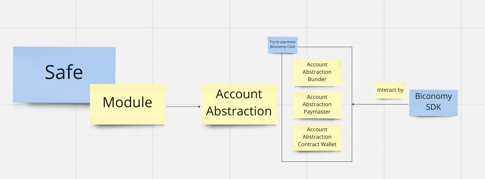

# DigiGo - Account Abstraction

This dir is for PoC of integrating Biconomy SDK, Safe with Account Abstraction, contains smart-contract, bundler, and sample frontend.

This implementation may get complicated, so I set up a different dev environment from the app.

## How it works

## Motivation

### Safe

> As the Gnosis Safe is one of the most popular smart contract wallets out there, we hope to make it a first-class account abstraction contract for ERC-4337. Hopefully, using a tried and true piece of infrastracture will make the ERC-4337 ecosystem more trustworthy as a whole.

https://hackmd.io/@erc4337/report2

We agree with the concept which is written in the above article, this is why we use Safe as the main wallet in our Account Abstraction architecture.

The basic Safe module implementation is extended from
https://github.com/eth-infinitism/account-abstraction/blob/develop/contracts/gnosis/GnosisSafeProxy4337.sol

We added the plugins for meta transactions, paying the gas fee by payment token, and session key, in this hackathon. This allows a better user experience, and this can be configured according to the user's security requirements.

And also we are integrating with Polygon ID to make Safe a credential-based identity wallet, and Push Chat to make Safe a chat-enabled wallet. 

### Polygon ID
this is credential for hackers
In our usecase, we can get more benefit by providing this kind of credential.

https://platform-test.polygonid.com/claim-link/ee34ac11-d884-4d0b-8163-07b088d5548f

